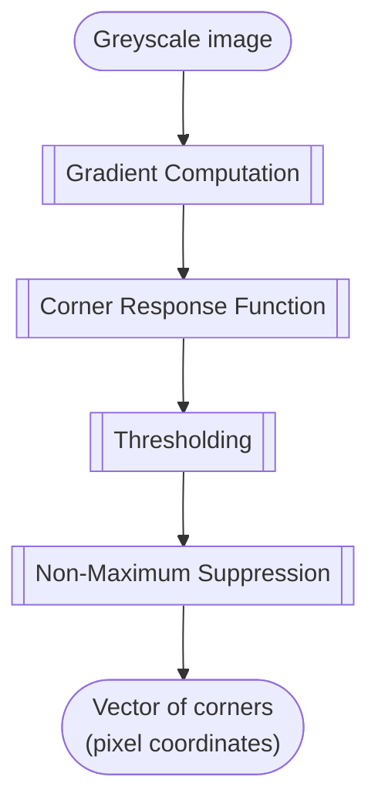

# Harris Corner Detector <!-- omit in toc -->

This location host a library that implements the Harris corner detector using
just C++ STL as dependency for the algorithm implementation.

- [References](#references)
- [Algorithm details](#algorithm-details)
  - [Gradient Computation](#gradient-computation)
  - [Corner Response Function](#corner-response-function)
  - [Thresholding](#thresholding)
  - [Non-Maximum Suppression](#non-maximum-suppression)
- [Other alternatives](#other-alternatives)

## References

> 📋 Harris corner detector is based on the paper: [*C. Harris and M. Stephens.
> A Combined Corner and Edge Detector.
> 1988*](https://citeseerx.ist.psu.edu/document?repid=rep1&type=pdf&doi=88cdfbeb78058e0eb2613e79d1818c567f0920e2).

> 💻 It is available in OpenCV as the function
> [`cv::cornerHarris()`](https://docs.opencv.org/4.8.0/dd/d1a/group__imgproc__feature.html#gac1fc3598018010880e370e2f709b4345)
> from the `imgproc` module (`#include <opencv2/imgproc.hpp>`).

> 📺 Youtube video [Corner Detection | Edge Detection](https://youtu.be/Z_HwkG90Yvw?si=2sabp_F_d8GtHvqd) from First Principles of Computer Vision channel.

> 👩‍💻 GITHUB repo [sohelmsc/Harris-Corner-Detection](https://github.com/sohelmsc/Harris-Corner-Detection/tree/master) with plain C++
> implementation of a corner detector.

## Algorithm details

### Gradient Computation

First, the algorithm calculates the gradient of the image at each pixel. This is
typically done using the Sobel operator, which computes the gradient magnitude
and direction.

### Corner Response Function

The corner response function is calculated for each pixel. The corner response
function is designed to be high for pixels that are corners and low for pixels
that are not.

### Thresholding

A threshold is applied to the corner response function. Pixels with a corner
response value above the threshold are considered corners.

### Non-Maximum Suppression

Finally, non-maximum suppression is applied to the detected corners to remove
false positives. This involves checking the corner response values of
neighbouring pixels and removing any corners that are not significantly higher
than their neighbors.

## Other alternatives

- [Accurate Detection and Localization of Checkerboard Corners for Calibration.
  Duda, Frese. 2018](http://bmvc2018.org/contents/papers/0508.pdf). This work is
  the one behind the newer method
  [`cv::findChessboardCornersSB()`](https://docs.opencv.org/4.8.0/d9/d0c/group__calib3d.html#gadc5bcb05cb21cf1e50963df26986d7c9).
  It uses a center line model to detect the corners in the pattern.
